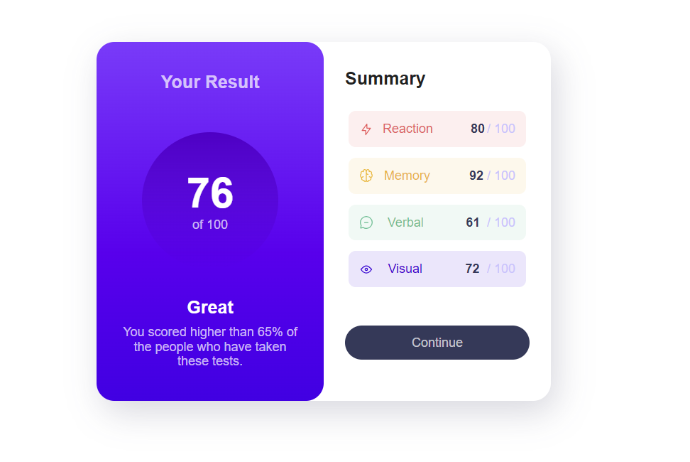

# Frontend Mentor - Results summary component solution

This is a solution to the [Results summary component challenge on Frontend Mentor](https://www.frontendmentor.io/challenges/results-summary-component-CE_K6s0maV). Frontend Mentor challenges help you improve your coding skills by building realistic projects. 

## Table of contents

- [Overview](#overview)
  - [The challenge](#the-challenge)
  - [Screenshot](#screenshot)
  - [Links](#links)
  - [Built with](#built-with)
  - [What I learned](#what-i-learned)
  - [Continued development](#continued-development)
- [Author](#author)

## Overview

### The challenge

Users should be able to:

- View the optimal layout for the interface depending on their device's screen size
- See hover and focus states for all interactive elements on the page

### Screenshot

### Links

- Solution URL: https://github.com/rsimmons11/results-summary-component.git
- Live Site URL: https://stirring-cannoli-db0231.netlify.app/

### Built with

- Semantic HTML5 markup
- CSS custom properties
- Flexbox
- Mobile-first workflow
- Media queries for RWD

### What I learned

Developed utilizing custom CSS, Flexbox, and media queries. While the custom CSS variables contribute to code legibility, they might not be essential for this small-scale project and may not significantly expedite the development process.

## Author

- Frontend Mentor - [@rsimmons11](https://www.frontendmentor.io/profile/rsimmons11)
- Twitter - [@RobertS40455705](https://twitter.com/RobertS40455705)

